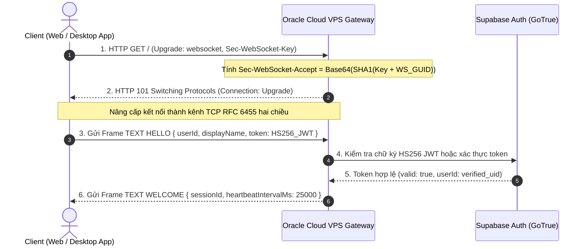
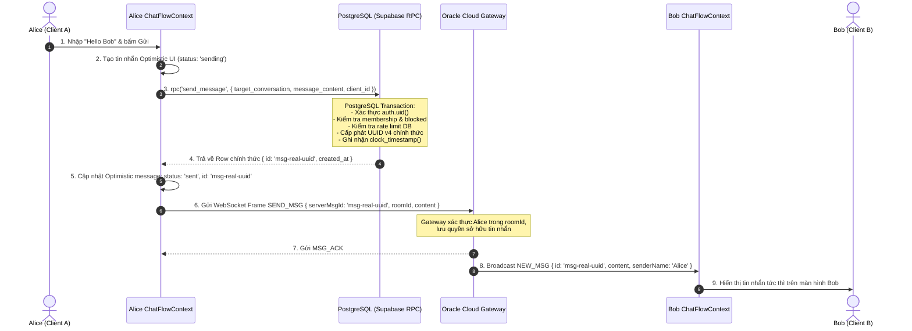
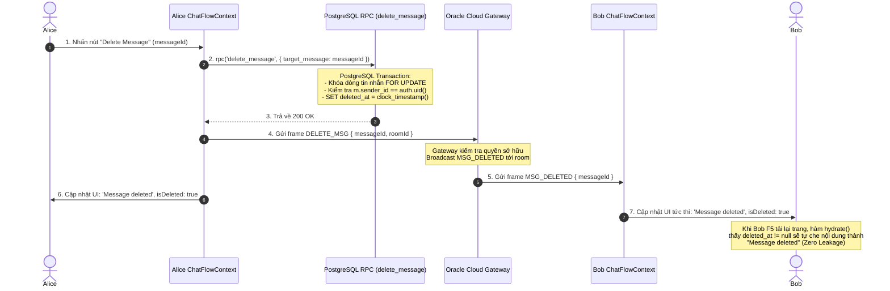
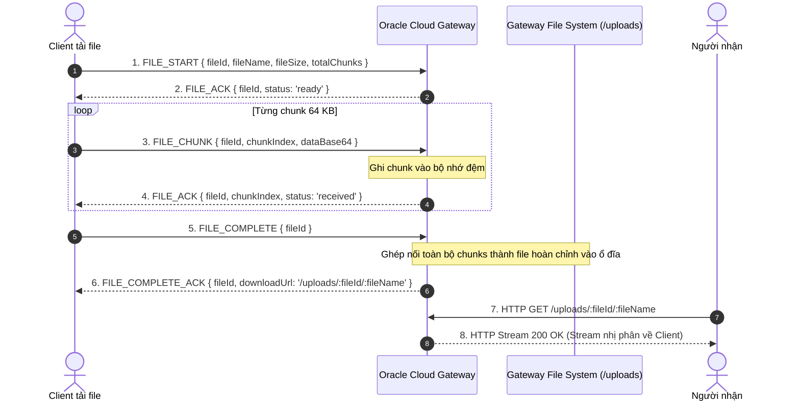

# ChatFlow — Ứng Dụng Nhắn Tin Thời Gian Thực Phân Tán (Đồ Án Lập Trình Mạng)

[](https://github.com/Asdb24/DoAnLapTrinhMang/releases/tag/v0.1.1)
[](https://github.com/Asdb24/DoAnLapTrinhMang/releases/tag/v0.1.1)
[](docs/TECHNICAL_DOCUMENTATION.md)
[](docs/API.md)
[](docs/VERIFICATION.md)

ChatFlow là ứng dụng nhắn tin và cộng tác nhóm thời gian thực phân tán, kết hợp giữa kiến trúc **Next.js 16 + React 19 + Electron Desktop**, cơ sở dữ liệu **Supabase PostgreSQL (Row Level Security & RPC)** và **Custom Gateway Server (RFC 6455 WebSocket)** tự viết từ socket TCP thuần chạy trên **Oracle Cloud VPS**.

---

## 👥 Nhóm Thực Hiện Đề Tài

| STT | Họ và Tên | Lớp | Mã Số Sinh Viên | Vai trò |
| :---: | :--- | :---: | :---: | :--- |
| 1 | **Trần Nguyễn Quốc Vinh** | 23DTHJA1 | `2380602569` | Trưởng nhóm / Phát triển hệ thống |
| 2 | **Trần Toàn** | 23DTHJA1 | `2380602277` | Thành viên / Cơ sở dữ liệu & Backend |
| 3 | **Trần Đức Huy** | 23DTHJA1 | `2380600888` | Thành viên / Giao diện & Gateway Mạng |

---

## 🚀 Tải Bản Cài Đặt Desktop (.exe) Đã Đóng Gói Sẵn

Ứng dụng Windows Desktop đã được đóng gói tự động qua GitHub Actions CI/CD và kết nối sẵn với máy chủ Cloud thật (không cần cấu hình `.env`):

* 📦 **Tải bản cài đặt NSIS:** [ChatFlow.Setup.0.1.1.exe](https://github.com/Asdb24/DoAnLapTrinhMang/releases/download/v0.1.1/ChatFlow.Setup.0.1.1.exe)
* ⚡ **Tải bản Portable (Chạy ngay không cần cài đặt):** [ChatFlow.0.1.1.exe](https://github.com/Asdb24/DoAnLapTrinhMang/releases/download/v0.1.1/ChatFlow.0.1.1.exe)
* 🔗 **Trang phát hành chính thức:** [GitHub Releases v0.1.1](https://github.com/Asdb24/DoAnLapTrinhMang/releases/tag/v0.1.1)

---

## 🔑 Tài Khoản Kiểm Thử Trực Tiếp (Live Test Accounts)

Hệ thống đã có sẵn tài khoản thật trên máy chủ Cloud để giáo viên hoặc người chấm đồ án kiểm thử trực tiếp:

| Người dùng | Email | Mật khẩu | Trạng thái |
| :--- | :--- | :--- | :---: |
| **Alice** | `alice@gmail.com` | `Password123!` | Đã kích hoạt (Active) |
| **Bob** | `bob@gmail.com` | `Password123!` | Đã kích hoạt (Active) |

> 💡 *Bạn cũng có thể bấm nút **Đăng ký (Sign Up)** trực tiếp trên giao diện ứng dụng để tạo thêm tài khoản mới bất kỳ.*

---

## 🏗️ Kiến Trúc Mạng & Công Nghệ (Network Architecture)

```
┌────────────────────────────────────────────────────────────────────────┐
│                        ChatFlow Clients                                │
│   ┌───────────────────────────────┐  ┌─────────────────────────────┐   │
│   │ Next.js 16 Web Client (React) │  │ Electron Desktop App (.exe) │   │
│   └──────────────┬────────────────┘  └──────────────┬──────────────┘   │
└──────────────────┼──────────────────────────────────┼──────────────────┘
                   │                                  │
                   │ HTTPS / WSS                      │ Binary Chunk / RFC 6455
                   ▼                                  ▼
┌──────────────────────────────────────┐  ┌──────────────────────────────┐
│        Supabase Cloud Engine         │  │ Oracle Cloud VPS Gateway     │
│  - GoTrue Authentication (JWT)       │  │ (168-138-160-93.sslip.io)    │
│  - PostgreSQL 16 + RLS Policies      │  │ - Custom RFC 6455 WebSocket  │
│  - 16 Transactional SQL RPCs         │  │ - TCP Socket Engine (node:net│
│  - Realtime Change Notifications     │  │ - Sliding Window Rate Limit  │
│  - Private Storage Bucket Engine     │  │ - Chunked Streaming File Srv │
└──────────────────────────────────────┘  └──────────────────────────────┘
```

### 1. Phân Tầng Công Nghệ:
* **Giao diện & Client:** Next.js 16 (App Router), React 19, TypeScript, Tailwind CSS, Radix UI (shadcn/ui), Lucide Icons.
* **Desktop Wrapper:** Electron 44, `electron-builder`, tích hợp node runtime nội bộ.
* **Cơ sở dữ liệu & Xác thực:** Supabase Auth (GoTrue), PostgreSQL với 100% chính sách Row Level Security (RLS) bảo vệ từng hàng dữ liệu, RPC transactional functions.
* **Máy chủ Gateway thời gian thực:**
  - Tự hiện thực hóa từ tầng socket TCP (`node:net`, `node:http`, `node:crypto`), tuân thủ chuẩn **RFC 6455 WebSocket Protocol**.
  - Triển khai độc lập trên máy chủ **Oracle Cloud VPS** (`wss://168-138-160-93.sslip.io`).
  - Hỗ trợ truyền nhận Frame-level, giải mã Masking Key, kiểm tra XOR byte payload, gửi nhận file dạng nhị phân theo từng chunk (Chunked File Transfer) kèm HTTP download streaming endpoint.

### 2. Tiêu Chuẩn "Zero Mock Data & Zero Seed Data":
* **Không sử dụng mock data:** Toàn bộ dữ liệu tin nhắn, phòng chat, danh bạ được lưu trữ và truy vấn trực tiếp từ cơ sở dữ liệu PostgreSQL thật.
* **Không có cửa sau giả mạo (No mock tokens):** Mọi gói tin kết nối đều được xác thực chữ ký mật mã **HS256 JWT** hoặc kiểm tra trực tiếp qua API Supabase Auth. Các gói tin mạo danh sẽ bị Gateway từ chối và đóng socket ngay lập tức (`code: 4001`).

---

## 📡 Giao Thức Truyền Tin & Thao Tác Mạng (Protocol Details)

Để biết chi tiết về cấu trúc gói tin, giải thích từng byte nhị phân của khung WebSocket RFC 6455, quy trình bắt tay (Handshake), gửi tin nhắn, sửa tin nhắn (Edit), xóa/thu hồi tin nhắn (Delete/Revoke) và truyền file từng phần, xin vui lòng xem tài liệu kỹ thuật chuyên sâu:

👉 **[docs/TECHNICAL_DOCUMENTATION.md](docs/TECHNICAL_DOCUMENTATION.md)**

## 🔄 Sơ Đồ Luồng Hoạt Động Hệ Thống (Mermaid Diagrams)

### 1. Luồng Bắt Tay Kết Nối & Xác Thực (Handshake & Authentication Flow)


---

### 2. Luồng Gửi & Đồng Bộ Tin Nhắn Thời Gian Thực (Authoritative Message Flow)


---

### 3. Luồng Sửa & Xóa / Thu Hồi Tin Nhắn (Edit & Delete/Revoke Message Flow)


---

### 4. Luồng Truyền Tệp Đính Kèm Phân Đoạn (Chunked Binary Streaming Flow)


---

## 💻 Cài Đặt Và Chạy Local

### 1. Yêu cầu môi trường:
* Node.js >= 22.13.0
* npm >= 10.x

### 2. Cài đặt các gói phụ thuộc:
```powershell
# Cài đặt frontend & desktop dependencies
npm install

# Cài đặt Gateway dependencies
cd gateway
npm install
npm run build
cd ..
```

### 3. Cấu hình biến môi trường (`.env.local`):
Tạo file `.env.local` ở thư mục gốc:
```env
NEXT_PUBLIC_APP_URL=http://localhost:3100
NEXT_PUBLIC_SUPABASE_URL=https://boonwujyiwqbrraqdbdy.supabase.co
NEXT_PUBLIC_SUPABASE_PUBLISHABLE_KEY=sb_publishable_xv9IiylFCrxZgG3WHnk7mw_as0YB9gH
NEXT_PUBLIC_SUPABASE_ANON_KEY=sb_publishable_xv9IiylFCrxZgG3WHnk7mw_as0YB9gH
NEXT_PUBLIC_GATEWAY_URL=wss://168-138-160-93.sslip.io
```

### 4. Khởi chạy ứng dụng:
* **Chạy Web (Next.js):**
  ```powershell
  npm run dev
  ```
  Truy cập: [http://localhost:3000](http://localhost:3000)

* **Chạy Desktop (Electron Dev):**
  ```powershell
  npm run electron:dev
  ```

* **Khởi chạy Gateway độc lập (nếu muốn chạy gateway local thay vì Cloud):**
  ```powershell
  npm --prefix gateway run dev
  ```

---

## 🧪 Hệ Thống Kiểm Thử Tự Động (Empirical Test Suites)

Dự án trang bị hệ thống kiểm thử tự động toàn diện, không phỏng đoán, đảm bảo chất lượng kỹ thuật cao nhất:

```powershell
# 1. Kiểm tra toàn bộ kiểu dữ liệu TypeScript (0 lỗi)
npm run typecheck

# 2. Kiểm thử bảo mật RLS và Database Engine (232 assertions PGlite)
npm run test:db

# 3. Kiểm thử giao diện và hành vi tương tác Vitest (101 unit tests)
npm test

# 4. Kiểm thử bảo mật và giao thức mạng Gateway RFC 6455 (11 tests)
node gateway/test/gateway-e2e.test.mjs

# 5. Kiểm thử rò rỉ khóa bí mật trong gói bundle (Secret Scanner)
npm run test:secrets

# 6. Kiểm thử kết nối thời gian thực 2 chiều giữa 2 user trên VPS Oracle Cloud
node scripts/test-live-gateway-chat.mjs
```

---

## 📂 Cấu Trúc Thư Mục

```text
├── .github/workflows/       CI/CD GitHub Actions đóng gói Windows .exe tự động
├── docs/                    Tài liệu kỹ thuật từ A-Z
│   ├── TECHNICAL_DOCUMENTATION.md  Đặc tả giao thức mạng, RFC 6455, luồng tin nhắn
│   ├── API.md               Hợp đồng API và quyền RLS
│   ├── DEPLOYMENT.md        Hướng dẫn triển khai production
│   └── VERIFICATION.md      Báo cáo kiểm thử và bảo mật
├── electron/                Source code ứng dụng Electron Desktop (.exe)
├── gateway/                 Máy chủ ChatFlow Gateway RFC 6455 (node:net, node:http)
│   ├── src/                 Socket engine, WebSocket Frame Codec, Rate Limiter
│   └── test/                Bộ kiểm thử E2E Gateway & Security Guards
├── scripts/                 Các kịch bản kiểm thử mạng, database và cloud
├── src/
│   ├── app/                 Next.js App Router (Layouts, Pages, Routes)
│   ├── components/          Giao diện người dùng Chat, Channel, Settings, Media
│   ├── context/             ChatFlow Context Provider quản lý state thời gian thực
│   ├── services/            Tầng dịch vụ (messages, storage, realtime, workspace)
│   └── lib/                 Supabase client, theme tokens
└── supabase/migrations/     10 file migrations SQL (Schema, RLS, Trigger, RPC)
```

---

## 📜 Giấy Phép & Bản Quyền
Đồ án thuộc môn **Lập Trình Mạng** — Được xây dựng phục vụ mục đích nghiên cứu học tập và đánh giá đồ án.
