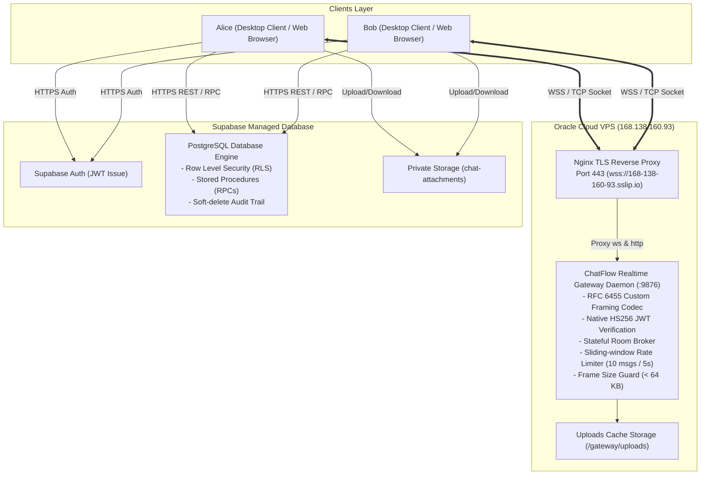
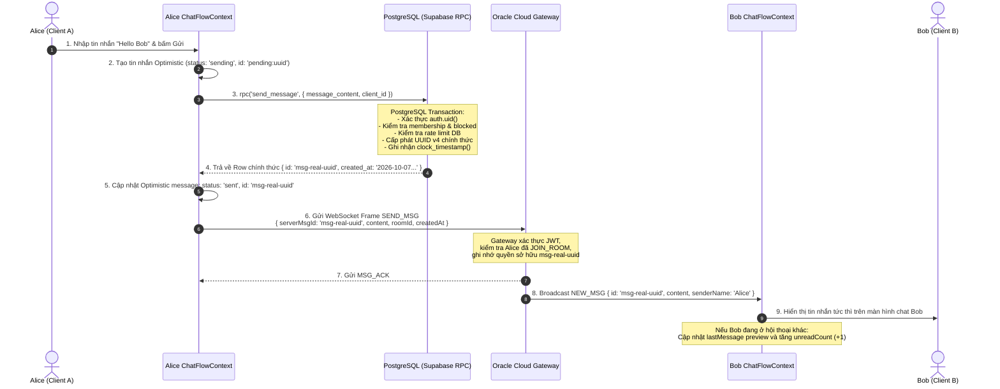
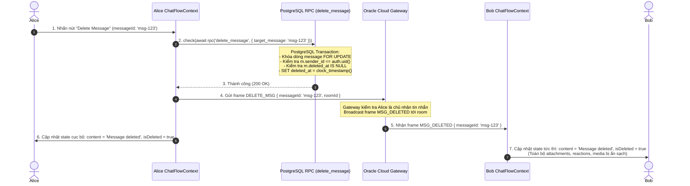

# TÀI LIỆU KỸ THUẬT HỆ THỐNG CHATFLOW
## Kiến Trúc Microservices, Giao Thức Mạng RFC 6455, Oracle Gateway & Luồng Dữ Liệu Từ A-Z

---

## MỤC LỤC
1. [Tổng Quan Kiến Trúc Hệ Thống (System Architecture)](#1-tổng-quan-kiến-trúc-hệ-thống)
2. [Giao Thức Truyền Tin: Byte Hay Chuỗi? Mã Hóa Chi Tiết](#2-giao-thức-truyền-tin-byte-hay-chuỗi)
   - 2.1. Tầng Nhị Phân (Binary Level) — RFC 6455 WebSocket Framing
   - 2.2. Tầng Ứng Dụng (Application Level) — JSON Opcodes
3. [Vai Trò Của Oracle Cloud VPS (168.138.160.93)](#3-vai-trò-của-oracle-cloud-vps)
4. [Quy Trình Gửi Tin Nhắn Từ A-Z (Authoritative Flow)](#4-quy-trình-gửi-tin-nhắn-từ-a-z)
5. [Quy Trình Sửa & Xóa Tin Nhắn: Tại Sao Alice Xóa Thì Bob Không Xem Được?](#5-quy-trình-sửa--xóa-tin-nhắn)
   - 5.1. Luồng Phát Tán Thời Gian Thực (Realtime Broadcast)
   - 5.2. Luồng Kiểm Toán Trong Cơ Sở Dữ Liệu (Audit Trail Compliance)
   - 5.3. Cơ Chế Hydration Lọc Dữ Liệu Khi Tải Lại Trang
6. [Hệ Thống Đính Kèm File & Chunked Binary Upload](#6-hệ-thống-đính-kèm-file)
7. [Desktop Client: Electron Standalone & Zero Blank Screen](#7-desktop-client-electron-standalone)
8. [Bảng Tra Cứu Tệp Mã Nguồn Cốt Lõi (Code Reference Map)](#8-bảng-tra-cứu-tệp-mã-nguồn-cốt-lõi)

---

## 1. TỔNG QUAN KIẾN TRÚC HỆ THỐNG

ChatFlow áp dụng kiến trúc **Hybrid Authoritative Microservices**, kết hợp giữa cơ sở dữ liệu quan hệ bảo mật cao (PostgreSQL) và máy chủ định tuyến thời gian thực hiệu năng cao (Realtime Gateway):



### Ba Thành Phần Cốt Lõi:
1. **Frontend / Desktop Client (Next.js 16 + React 19 + Electron):** Cung cấp giao diện người dùng thời gian thực, quản lý optimistic updates (hiển thị trước khi DB xác nhận), và duy trì kết nối WebSocket song công tới Gateway.
2. **Oracle Cloud VPS (Realtime Gateway):** Máy chủ đám mây độc lập chạy Linux, đóng vai trò trạm trung chuyển gói tin siêu tốc (Stateful Broker), quản lý danh sách phòng chat, gõ phím (typing indicator), trạng thái online/offline (presence) và kiểm duyệt an ninh tầng mạng.
3. **Supabase PostgreSQL (Authoritative Source of Truth):** Nơi lưu trữ vĩnh viễn, chịu trách nhiệm cấp phát UUID, mốc thời gian chuẩn (`created_at`, `edited_at`, `deleted_at`), kiểm soát quyền thành viên (RLS) và ngăn chặn gian lận dữ liệu.

---

## 2. GIAO THỨC TRUYỀN TIN: BYTE HAY CHUỖI?

Giao thức truyền tin trong ChatFlow hoạt động theo **2 tầng giao thức (2-Layer Protocol)**:
- **Tầng Vận Chuyển (Transport Framing):** Truyền nhận theo từng **BYTE NHỊ PHÂN** tuân theo đặc tả **RFC 6455 WebSocket Framing**.
- **Tầng Ứng Dụng (Application Layer):** Truyền nhận theo **CHUỖI KÝ TỰ UTF-8 CÓ CẤU TRÚC (JSON String)** được đóng gói bên trong payload của WebSocket Text Frame (`Opcode 0x1`).

```
┌───────────────────────────────────────────────────────────┐
│ Tầng Ứng Dụng (L7): JSON Packets (Chuỗi UTF-8 có cấu trúc)  │
│ { type: 'SEND_MSG', roomId: '...', content: '...', ... } │
├───────────────────────────────────────────────────────────┤
│ Tầng Vận Chuyển: RFC 6455 WebSocket Binary Framing (Byte)  │
│ [Byte 0: FIN+Opcode] [Byte 1: MASK+Len] [MaskKey] [Bytes]  │
├───────────────────────────────────────────────────────────┤
│ Tầng Mạng: TCP Stream qua TLS 1.3 (WSS)                   │
└───────────────────────────────────────────────────────────┘
```

### 2.1. Tầng Nhị Phân (Binary Level) — RFC 6455 WebSocket Framing Codec
ChatFlow **tự hiện thực bộ giải mã/đóng gói byte (Codec) từ đầu** bằng Node.js Buffer nguyên bản tại `gateway/src/websocket-codec.ts`, không phụ thuộc vào thư viện bên ngoài (`ws`, `socket.io`).

Cấu trúc từng Byte truyền trên đường truyền mạng:

```
 0                   1                   2                   3
 0 1 2 3 4 5 6 7 8 9 0 1 2 3 4 5 6 7 8 9 0 1 2 3 4 5 6 7 8 9 0 1
+-+-+-+-+-------+-+-------------+-------------------------------+
|F|R|R|R| opcode|M| Payload len |    Extended payload length    |
|I|S|S|S|  (4)  |A|     (7)     |             (16/64)           |
|N|V|V|V|       |S|             |   (if payload len==126/127)   |
| |1|2|3|       |K|             |                               |
+-+-+-+-+-------+-+-------------+ - - - - - - - - - - - - - - - +
|     Extended payload length continued, if payload len == 127  |
+ - - - - - - - - - - - - - - - +-------------------------------+
|                               |Masking-key, if MASK set to 1  |
+-------------------------------+-------------------------------+
| Masking-key (continued)       |          Payload Data         |
+-------------------------------- - - - - - - - - - - - - - - - +
:                     Payload Data continued ...                :
+---------------------------------------------------------------+
```

#### Mã Nguồn Xử Lý Từng Byte Cụ Thể:
- **Bắt tay HTTP Upgrade (Handshake):** [`gateway/src/websocket-codec.ts#L30-L50`](file:///d:/DoAnLapTrinhMang/DoAnLapTrinhMang/gateway/src/websocket-codec.ts#L30-L50)
  ```typescript
  export function computeAcceptKey(clientKey: string): string {
    return createHash('sha1')
      .update(clientKey.trim() + WS_GUID) // WS_GUID = '258EAFA5-E914-47DA-95CA-C5AB0DC85B11'
      .digest('base64');
  }
  ```
- **Tách và phân tích Byte Header:** [`gateway/src/websocket-codec.ts#L60-L83`](file:///d:/DoAnLapTrinhMang/DoAnLapTrinhMang/gateway/src/websocket-codec.ts#L60-L83)
  ```typescript
  const firstByte = buffer[offset];
  const secondByte = buffer[offset + 1];

  const fin = (firstByte & 0x80) !== 0;             // Bit 7: Frame cuối cùng trong tin nhắn
  const opcode = (firstByte & 0x0f) as Opcode;     // Bits 0-3: 0x1=TEXT, 0x2=BINARY, 0x8=CLOSE, 0x9=PING, 0xA=PONG
  const masked = (secondByte & 0x80) !== 0;        // Bit 7: Client gửi lên server BẮT BUỘC có mặt nạ (masked=1)
  let payloadLen = secondByte & 0x7f;              // 7 bits payload length

  // Mở rộng độ dài payload theo chuẩn RFC 6455
  if (payloadLen === 126) {
    payloadLen = buffer.readUInt16BE(offset + 2);   // Đọc 2 byte unsigned big-endian
    headerLen += 2;
  } else if (payloadLen === 127) {
    const bigLen = buffer.readBigUInt64BE(offset + 2); // Đọc 8 byte unsigned big-endian
    payloadLen = Number(bigLen);
    headerLen += 8;
  }
  ```
- **Giải mặt nạ XOR (Bitwise Unmasking):** [`gateway/src/websocket-codec.ts#L100-L105`](file:///d:/DoAnLapTrinhMang/DoAnLapTrinhMang/gateway/src/websocket-codec.ts#L100-L105)
  ```typescript
  // RFC 6455 Section 5.3: Mỗi byte thứ i được phục hồi bằng phép XOR với byte maskKey[i % 4]
  for (let i = 0; i < payloadLen; i++) {
    unmaskedPayload[i] = rawPayload[i] ^ maskKey[i % 4];
  }
  ```
- **Đóng gói Frame từ Server gửi về Client:** [`gateway/src/websocket-codec.ts#L129-L160`](file:///d:/DoAnLapTrinhMang/DoAnLapTrinhMang/gateway/src/websocket-codec.ts#L129-L160)
  Khung dữ liệu từ Server gửi trả về cho Client theo chuẩn RFC 6455 là **Unmasked Frame** (Mask bit = 0).

---

### 2.2. Tầng Ứng Dụng (Application Level) — JSON Opcodes
Sau khi byte payload được unmask thành mảng byte hoàn chỉnh, Node.js giải mã mảng byte thành chuỗi ký tự UTF-8 và parse JSON:
`const packet: GatewayPacket = JSON.parse(frame.payload.toString('utf8'));`

Các loại gói tin định nghĩa trong [`gateway/src/protocol.ts`](file:///d:/DoAnLapTrinhMang/DoAnLapTrinhMang/gateway/src/protocol.ts):

| Tên Gói Tin | Hướng | Định Dạng Dữ Liệu | Mục Đích |
|---|---|---|---|
| `HELLO` | Client ➔ Gateway | `{ type: 'HELLO', userId, displayName, token }` | Định danh người dùng & truyền JWT token |
| `WELCOME` | Gateway ➔ Client | `{ type: 'WELCOME', sessionId, heartbeatIntervalMs }` | Xác nhận bắt tay thành công |
| `JOIN_ROOM` | Client ➔ Gateway | `{ type: 'JOIN_ROOM', roomId }` | Tham gia vào một phòng trò chuyện |
| `ROOM_ACK` | Gateway ➔ Client | `{ type: 'ROOM_ACK', roomId, status: 'joined' }` | Xác nhận đã vào phòng |
| `SEND_MSG` | Client ➔ Gateway | `{ type: 'SEND_MSG', roomId, content, serverMsgId, createdAt, attachments }` | Phát tán tin nhắn tới phòng |
| `NEW_MSG` | Gateway ➔ Client | `{ type: 'NEW_MSG', msg: { id, content, senderId, ... } }` | Thông báo tin nhắn mới tới toàn bộ thành viên |
| `MSG_ACK` | Gateway ➔ Sender | `{ type: 'MSG_ACK', clientMsgId, serverMsgId, roomId }` | Báo người gửi biết tin nhắn đã vào Gateway |
| `EDIT_MSG` | Client ➔ Gateway | `{ type: 'EDIT_MSG', messageId, roomId, newContent }` | Yêu cầu sửa tin nhắn |
| `MSG_EDITED` | Gateway ➔ Client | `{ type: 'MSG_EDITED', messageId, roomId, newContent }` | Phát tán nội dung tin nhắn đã sửa đổi |
| `DELETE_MSG` | Client ➔ Gateway | `{ type: 'DELETE_MSG', messageId, roomId }` | Yêu cầu xoá tin nhắn |
| `MSG_DELETED` | Gateway ➔ Client | `{ type: 'MSG_DELETED', messageId, roomId }` | Phát tán thông báo tin nhắn đã bị xoá |
| `TYPING` | Hai chiều | `{ type: 'TYPING', roomId, userId, isTyping }` | Báo trạng thái người dùng đang soạn tin |
| `FILE_CHUNK` | Client ➔ Gateway | `{ type: 'FILE_CHUNK', uploadId, chunkIndex, data: 'base64...' }` | Tải lên từng khối nhị phân 64 KB |

---

## 3. VAI TRÒ CỦA ORACLE CLOUD VPS (168.138.160.93)

Máy chủ Oracle Cloud VPS (Ubuntu 24.04 LTS, IP công khai `168.138.160.93`) giữ vai trò cốt lõi trong hạ tầng:

1. **Host ChatFlow Realtime Gateway Daemon:**
   - Tiến trình Node.js chạy liên tục dưới sự quản lý của `systemd` (`chatflow-gateway.service`).
   - Lắng nghe tại cổng nội bộ `9876`, quản lý toàn bộ các socket TCP đang mở của các client.
2. **Reverse Proxy & TLS Termination:**
   - Nginx nhận traffic bảo mật tại cổng `443` thông qua tên miền wildcard `168-138-160-93.sslip.io`.
   - Chứng chỉ SSL được cấp phát và tự động gia hạn qua Let's Encrypt Certbot.
   - Chuyển tiếp kết nối WSS (`Upgrade: websocket`) an toàn vào cổng `9876`.
3. **Thực Thi Bảo Mật & Phòng Thủ Mạng (Security Guards):**
   - **Xác thực chữ ký JWT Native (HS256):** Kiểm tra HMAC-SHA256 signature với `JWT_SECRET` của hệ thống. Token giả mạo hoặc hết hạn sẽ bị đóng socket ngay lập tức ([`gateway/src/server.ts#L110-L148`](file:///d:/DoAnLapTrinhMang/DoAnLapTrinhMang/gateway/src/server.ts#L110-L148)).
   - **Room Authorization Guard:** Chặn người dùng gửi tin nếu chưa gia nhập phòng ([`gateway/src/server.ts#L368-L373`](file:///d:/DoAnLapTrinhMang/DoAnLapTrinhMang/gateway/src/server.ts#L368-L373)).
   - **Ownership Verification:** Chỉ người gửi gốc mới được phép phát lệnh `EDIT_MSG` hoặc `DELETE_MSG` ([`gateway/src/server.ts#L444-L465`](file:///d:/DoAnLapTrinhMang/DoAnLapTrinhMang/gateway/src/server.ts#L444-L465)).
   - **Anti-Spam / Rate Limiting:** Sliding-window đếm tần suất tin nhắn, ngắt kết nối nếu vượt quá 10 tin / 5 giây ([`gateway/src/server.ts#L152-L170`](file:///d:/DoAnLapTrinhMang/DoAnLapTrinhMang/gateway/src/server.ts#L152-L170)).
   - **Anti-DoS Frame Size:** Hủy kết nối với bất kỳ frame thô nào vượt quá 64 KB ([`gateway/src/server.ts#L254-L260`](file:///d:/DoAnLapTrinhMang/DoAnLapTrinhMang/gateway/src/server.ts#L254-L260)).
4. **Bộ Đệm Upload Tệp Phân Đoạn (Chunked File Storage):**
   - Lưu trữ các khối nhị phân vào `/gateway/uploads/` và ghép nối thành file hoàn chỉnh khi nhận gói `FILE_COMPLETE`.
   - Cung cấp endpoint HTTP GET `/uploads/:id` để người dùng tải file trực tiếp với tốc độ cao.

---

## 4. QUY TRÌNH GỬI TIN NHẮN TỪ A-Z (AUTHORITATIVE FLOW)

Để tránh hiện tượng lệch ID giữa cơ sở dữ liệu và kênh WebSocket thời gian thực, hệ thống triển khai kiến trúc **PostgreSQL Authoritative First**:



### Các Điều Kiện Ràng Buộc Khi Gửi Tin Nhắn:
1. **Kiểm tra độ dài ký tự:** Nội dung tin nhắn không được rỗng và không vượt quá 10.000 byte UTF-8 ([`supabase/migrations/20261003000000_core.sql#L120`](file:///d:/DoAnLapTrinhMang/DoAnLapTrinhMang/supabase/migrations/20261003000000_core.sql#L120)).
2. **Kiểm tra tư cách thành viên:** Người gửi phải là thành viên hợp lệ của cuộc trò chuyện (Direct Chat hoặc Channel).
3. **Kiểm tra trạng thái chặn (Block):** Nếu Alice bị Bob chặn hoặc Bob bị Alice chặn, giao dịch DB sẽ bị từ chối với ngoại lệ `Cannot message this user`.
4. **Cơ chế Idempotency chống trùng lặp:** Khóa `client_message_id` đảm bảo dù mạng bị chập chờn gửi lại RPC nhiều lần, DB chỉ ghi nhận 1 bản ghi duy nhất.
5. **Ràng buộc đính kèm file:** Mỗi tin nhắn tối đa 5 file, ảnh không vượt quá 10 MB, tài liệu không vượt quá 25 MB, và phải được cấp quyền (`reserve_attachment`) thành công trước khi gửi.

---

## 5. QUY TRÌNH SỬA & XÓA TIN NHẮN: TẠI SAO ALICE XÓA THÌ BOB KHÔNG XEM ĐƯỢC?

Một yêu cầu an ninh và trải nghiệm quan trọng: **Khi Alice bấm xoá tin nhắn, Bob lập tức không còn thấy nội dung; kể cả Bob F5 tải lại trang hay dùng tài khoản khác đăng nhập đều không thể đọc lại được.**

### 5.1. Luồng Phát Tán Thời Gian Thực (Realtime Broadcast)


### 5.2. Luồng Kiểm Toán Trong Cơ Sở Dữ Liệu (Audit Trail Compliance)
Khác với ứng dụng thông thường xoá trắng dữ liệu bằng lệnh SQL `DELETE FROM messages`, ChatFlow áp dụng quy chuẩn **Soft-Delete bảo toàn chứng cứ kiểm toán** trong [`supabase/migrations/20261005000000_message_actions.sql`](file:///d:/DoAnLapTrinhMang/DoAnLapTrinhMang/supabase/migrations/20261005000000_message_actions.sql):

```sql
create or replace function public.delete_message(target_message uuid) returns void language plpgsql security definer set search_path='' as $$
declare
  u uuid := chat_private.uid();
  m public.messages;
begin
  select * into m from public.messages where id = target_message for update;
  if not found then
    raise exception 'Message unavailable';
  end if;
  if m.sender_id <> u then
    raise exception 'Only the sender can delete their message';
  end if;
  if m.deleted_at is not null then
    raise exception 'Message already deleted';
  end if;
  
  -- Ghi nhận mốc thời gian xoá nhưng GIỮ NGUYÊN nội dung gốc phục vụ kiểm toán
  update public.messages
  set deleted_at = clock_timestamp(),
      updated_at = clock_timestamp()
  where id = target_message;
end $$;
```

### 5.3. Cơ Chế Hydration Lọc Dữ Liệu Khi Tải Lại Trang
Khi Bob F5, chuyển phòng hoặc cuộn xem lịch sử tin nhắn cũ qua hàm `messagePage()`:
Tại tệp [`src/services/messages.ts#L41-L45`](file:///d:/DoAnLapTrinhMang/DoAnLapTrinhMang/src/services/messages.ts#L41-L45), hàm `hydrate()` đóng vai trò cổng lọc dữ liệu (Data Sanitization Gate):

```typescript
return rows.map(row => {
  // ...
  return {
    id: row.id,
    // Nếu row.deleted_at khác null, nội dung BẮT BUỘC bị che phủ thành 'Message deleted'
    content: row.deleted_at ? 'Message deleted' : row.content,
    // Triệt tiêu media, đính kèm và reaction
    media: row.deleted_at ? null : row.media as ChatMedia | null,
    isDeleted: Boolean(row.deleted_at),
    isEdited: Boolean(row.edited_at),
    reactions: row.deleted_at ? [] : [...grouped.values()],
    attachments: row.deleted_at ? [] : files.filter(f => f.message_id === row.id).map(...),
  };
});
```
**Kết quả:** Dù Bob có can thiệp giao diện hay gọi lại API, Bob chỉ nhận được chuỗi `"Message deleted"` và hoàn toàn không thể tiếp cận được nội dung gốc hay các file đính kèm đã bị xoá.

---

## 6. HỆ THỐNG ĐÍNH KÈM FILE & CHUNKED BINARY UPLOAD

Hệ thống hỗ trợ 2 cơ chế truyền tải tệp tin đính kèm:
1. **Lưu trữ bảo mật đám mây (Private Storage Path):**
   - Client gọi RPC `reserve_attachment` để xin cấp phát định danh upload và kiểm tra hạn mức lưu trữ (tối đa 1 GB/người dùng).
   - Tệp tin tải lên bucket riêng tư `chat-attachments`. Tên đường dẫn vật lý trên server được mã hóa ngẫu nhiên, không để lộ qua URL công khai.
   - Khi tải file, hệ thống xác thực phiên làm việc thông qua API Route [`src/app/api/attachments/[id]/route.ts`](file:///d:/DoAnLapTrinhMang/DoAnLapTrinhMang/src/app/api/attachments/%5Bid%5D/route.ts).
2. **Truyền tệp phân đoạn qua Gateway (Chunked Binary Streaming):**
   - Hỗ trợ truyền tệp nhị phân trực tiếp qua WebSocket theo từng khối cố định **64 KB** (`CHUNK_SIZE = 64 * 1024`).
   - Gói `FILE_START` khởi tạo upload với `fileName`, `fileSize`, `totalChunks`.
   - Các gói `FILE_CHUNK` truyền tải payload Base64 kèm `chunkIndex`.
   - Gói `FILE_COMPLETE` ra lệnh cho Gateway ghép nối các khối thành tệp hoàn chỉnh và trả về URL tải về tốc độ cao qua Gateway Oracle VPS.

---

## 7. DESKTOP CLIENT: ELECTRON STANDALONE & ZERO BLANK SCREEN

Ứng dụng Desktop được đóng gói chuyên nghiệp bằng Electron với kiến trúc độc lập (Standalone):

1. **Khắc Phục Lỗi Spawn Con (`ELECTRON_RUN_AS_NODE: '1'`):**
   - Khi chạy từ bản đóng gói `.exe`, `process.execPath` trỏ đến chính file thực thi của Electron.
   - Để khởi động server Next.js cục bộ mà không bị mở lồng thêm cửa sổ GUI Electron thứ hai, hệ thống thiết lập biến môi trường bắt buộc:
     `ELECTRON_RUN_AS_NODE: '1'` tại [`electron/main.cjs#L79`](file:///d:/DoAnLapTrinhMang/DoAnLapTrinhMang/electron/main.cjs#L79).
2. **Next.js Standalone Packaging:**
   - Cấu hình `output: 'standalone'` trong `next.config.mjs`.
   - Script `scripts/prepare-standalone.mjs` tự động đồng bộ thư mục `.next/static` và `public` vào `.next/standalone/`, giúp ứng dụng Desktop có thể khởi chạy hoàn toàn độc lập mà không cần bộ thư viện `node_modules` nặng nề.
3. **Cơ Chế Chống Màn Hình Trắng (Zero Blank Screen Guard):**
   - Cửa sổ Electron khởi tạo với nền tối `#090d16` và tải ngay lập tức tệp Splash Screen nhúng sẵn [`electron/splash.html`](file:///d:/DoAnLapTrinhMang/DoAnLapTrinhMang/electron/splash.html).
   - Tiến trình chính thăm dò cổng HTTP nội bộ (`waitForServer`). Chỉ khi server cục bộ phản hồi HTTP 200, cửa sổ mới điều hướng đến ứng dụng chính.
   - Nếu xảy ra lỗi khởi động hoặc timeout, Splash Screen hiển thị hộp thoại thông báo lỗi trực quan kèm nút **Retry Connection** để khởi động lại tiến trình server con.
4. **Cấu Hình Đóng Gói `asarUnpack`:**
   - Trong `electron-builder.json`, cấu hình `"asarUnpack": [".next/standalone/**/*"]` để thư viện `server.js` được giải nén sẵn ngoài file nén asar, cho phép tiến trình Node con truy cập và thực thi trực tiếp.

---

## 8. BẢNG TRA CỨU TỆP MÃ NGUỒN CỐT LÕI (CODE REFERENCE MAP)

| Phân Vùng Chức Năng | Tệp Tin Mã Nguồn | Vị Trí Trọng Tâm |
|---|---|---|
| **Bộ Giải Mã WebSocket Byte (RFC 6455)** | [`gateway/src/websocket-codec.ts`](file:///d:/DoAnLapTrinhMang/DoAnLapTrinhMang/gateway/src/websocket-codec.ts) | Toàn bộ tệp (Bitwise masking, Opcode, Frame decoding/encoding) |
| **Định Nghĩa Gói Tin JSON Protocol** | [`gateway/src/protocol.ts`](file:///d:/DoAnLapTrinhMang/DoAnLapTrinhMang/gateway/src/protocol.ts) | Định nghĩa các gói tin `HELLO`, `SEND_MSG`, `NEW_MSG`, `EDIT_MSG`, `DELETE_MSG` |
| **Gateway Daemon (Oracle VPS)** | [`gateway/src/server.ts`](file:///d:/DoAnLapTrinhMang/DoAnLapTrinhMang/gateway/src/server.ts) | Quản lý kết nối, xác thực chữ ký JWT native, sliding-window rate limit, broadcast tin nhắn |
| **Bộ Kiểm Thử Gateway E2E** | [`gateway/test/gateway-e2e.test.mjs`](file:///d:/DoAnLapTrinhMang/DoAnLapTrinhMang/gateway/test/gateway-e2e.test.mjs) | 11/11 bài test kiểm thử bảo mật frame, token và chat 2 chiều |
| **Client Gateway Adapter** | [`src/services/gateway-client.ts`](file:///d:/DoAnLapTrinhMang/DoAnLapTrinhMang/src/services/gateway-client.ts) | Kết nối WSS tới `wss://168-138-160-93.sslip.io`, tự động kết nối lại, gửi/nhận packet |
| **Điều Phối Trạng Thái Ứng Dụng** | [`src/context/ChatFlowContext.tsx`](file:///d:/DoAnLapTrinhMang/DoAnLapTrinhMang/src/context/ChatFlowContext.tsx) | Quản lý `sendMessage`, `deleteMessage`, `editMessage`, optimistic state, cập nhật badge tin chưa đọc |
| **Lọc Dữ Liệu & Phân Trang** | [`src/services/messages.ts`](file:///d:/DoAnLapTrinhMang/DoAnLapTrinhMang/src/services/messages.ts) | Hàm `hydrate()` che dấu tin nhắn đã xoá, phân trang cursor tuple `(created_at, id)` |
| **Database RPC Sửa & Xoá** | [`supabase/migrations/20261005000000_message_actions.sql`](file:///d:/DoAnLapTrinhMang/DoAnLapTrinhMang/supabase/migrations/20261005000000_message_actions.sql) | Stored procedures `edit_message` và `delete_message` bảo tồn audit trail |
| **Desktop Client Main Process** | [`electron/main.cjs`](file:///d:/DoAnLapTrinhMang/DoAnLapTrinhMang/electron/main.cjs) | Spawn server con với `ELECTRON_RUN_AS_NODE: '1'`, Splash Screen, IPC retry |
| **Desktop Splash Screen** | [`electron/splash.html`](file:///d:/DoAnLapTrinhMang/DoAnLapTrinhMang/electron/splash.html) | Giao diện chờ khởi động màu tối với logo phát sáng và màn hình phục hồi lỗi |
| **Đồng Bộ Asset Standalone** | [`scripts/prepare-standalone.mjs`](file:///d:/DoAnLapTrinhMang/DoAnLapTrinhMang/scripts/prepare-standalone.mjs) | Tự động sao chép static files vào `.next/standalone` khi build |
